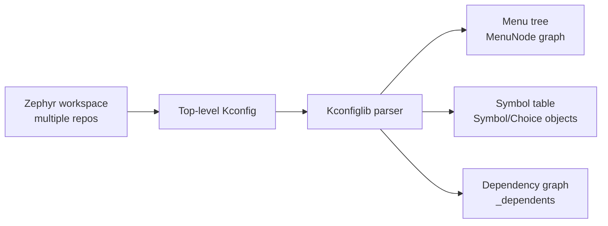
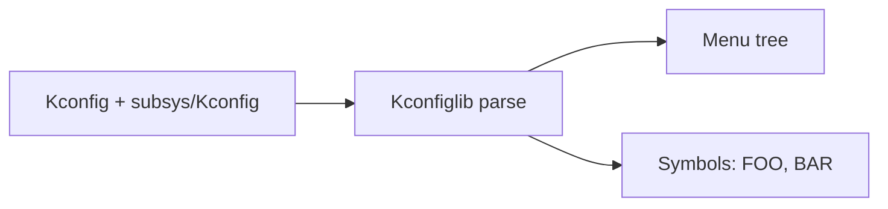

# Kconfiglib

## High‑Level Overview

Kconfiglib in Zephyr (scripts/kconfig/kconfiglib.py) is a single‑file Python implementation of the Kconfig parser and evaluator. It parses a top‑level Kconfig file, follows source
directives (with globbing), and builds:

- A menu tree (linked MenuNode objects) that models the Kconfig structure.
- A symbol table (Kconfig.syms, Kconfig.defined_syms, Symbol objects) containing types, defaults, dependencies, etc.
- Dependency graphs for incremental evaluation and loop detection.

It is multi‑repo friendly because source paths are expanded and resolved using srctree and file‑relative paths, letting Kconfig files in different repos/trees be pulled into a single
parse.



———

### Block 1: Inputs and Environment

Kconfiglib starts with Kconfig(filename="Kconfig"):

- srctree environment variable defines the base directory for resolving source lines.
- CONFIG\_ prefix, warning flags, and preprocessor functions are loaded.
- Predefined symbols n/m/y are created.

flowchart TD
A[Environment<br/>srctree, CONFIG_, KCONFIG_*] --> B[Kconfig.__init__]
B --> C[_init()]
C --> D[Init tables<br/>syms, choices, menus]
C --> E[Create n/m/y symbols]
C --> F[Set up preprocessor functions]

Key internal fields initialized here:

- self.syms / self.defined_syms / self.named_choices
- self.top_node (root MenuNode)
- self.\_readline for the top‑level file
- self.\_filestack for nested source recursion

———

## Block 2: Parsing Files and Expanding source

Parsing is driven by \_parse_block(end_token, parent, prev). It reads line‑by‑line, tokenizes, and dispatches on the first token:

- config, menuconfig, choice, menu, if, comment
- source expands to one or more filenames (glob)
- Relative source paths use the current file’s directory
- srctree is prepended for globbing and path resolution

flowchart TD
A[_parse_block] --> B{Line token}
B -->|config/menuconfig| C[Create MenuNode + Symbol]
B -->|menu/choice/if| D[Create MenuNode<br/>parse child block]
B -->|source| E[Resolve glob<br/>enter file + recurse]
B -->|comment| F[Create MenuNode]

How multi‑repo trees work:

- Each source line can point to a file in another repo under srctree.
- Because source can use globs (source "subsys/\*/Kconfig"), Kconfiglib expands and parses all matches in sorted order.
- Parsing order is deterministic due to sorting of glob results.

———

## Block 3: Finalization and Dependency Propagation

Each structural item creates a MenuNode. The node links into a singly‑linked list (next), and if it contains children it also has a list pointer.

flowchart LR
A[MenuNode parent] --> B[child node 1]
B --> C[child node 2]
C --> D[child node 3]

Key construction points:

- config / menuconfig nodes include a Symbol and start with empty properties.
- menu, choice, and if nodes create a parent and recurse into a child block.
- source recurses but does not create a node itself.

———

## Input files

Kconfig (top-level):

```kconfig
menu "Main"

source "subsys/Kconfig"
endmenu
```

subsys/Kconfig:

```kconfig
config FOO

    bool "Foo"
    depends on BAR

config BAR
bool "Bar"
default y
```

High‑level input/output



Step‑by‑step

1. Kconfig.**init**() opens Kconfig under srctree.
2. \_parse_block() sees menu → creates a menu node, parses children.
3. source "subsys/Kconfig" → resolved via srctree + current dir, file parsed.
4. config FOO → new MenuNode with Symbol("FOO").
   - \_parse_props: bool, prompt "Foo", depends on BAR
5. config BAR → new MenuNode with Symbol("BAR").
   - \_parse_props: bool, prompt "Bar", default y

Internal representation (simplified)

```mermaid
flowchart TD
A[Menu: "Main"] --> B[Node: FOO]
A --> C[Node: BAR]
```

Symbol details after finalization:

- FOO:
  - orig_type=BOOL
  - direct_dep = BAR
  - defaults = []
- BAR:
  - orig_type=BOOL
  - direct_dep = y
  - defaults = [(y, y, loc)]

The dependency propagation ensures the depends on BAR is captured in FOO.direct_dep, and any other properties would get BAR ANDed into their conditions.

———

## Summary of Key Internal Objects

Kconfig

- Holds global tables and the root menu.
- Key fields: syms, defined_syms, choices, top_node, warnings.

MenuNode

- Represents a node in the menu tree.
- Holds per‑definition properties: prompt, defaults, depends, ranges, etc.
- Linked via next and list.
